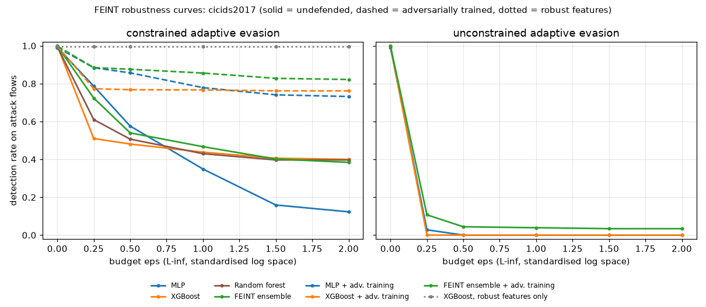
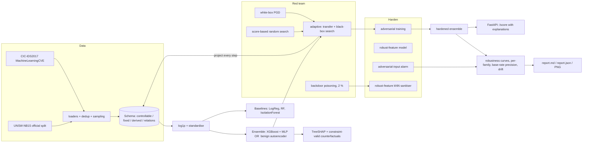
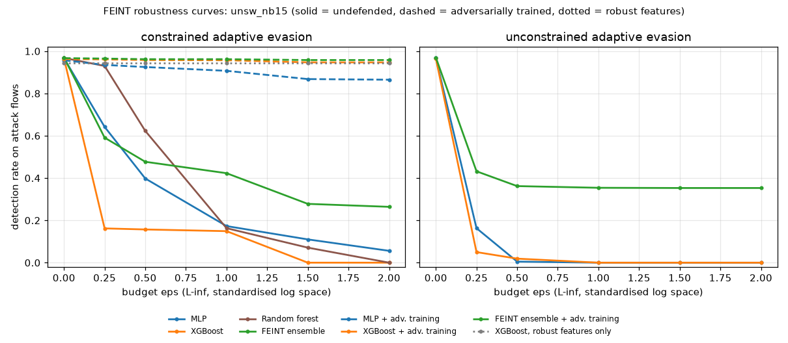
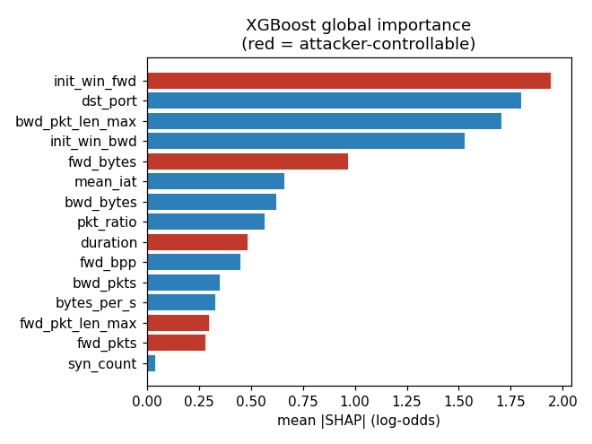
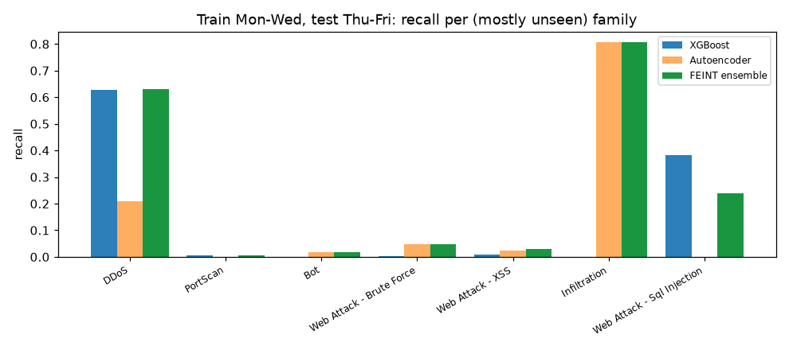

# FEINT

[](https://github.com/rakshit-737/feint/actions/workflows/ci.yml)

[](https://rakshit-737.github.io/feint/)
[](LICENSE)


**A network intrusion detector built to be attacked.** FEINT trains a flow-based NIDS ensemble on
CIC-IDS2017 and UNSW-NB15, red-teams it with *adaptive* evasion that respects what a network
attacker can actually change, poisons its training data, hardens it, explains every alert with
SHAP and constraint-valid counterfactuals, and reports **robustness curves and base-rate-honest
precision** instead of a single accuracy number.

> Everyone reports 99 % accuracy on CIC-IDS2017. FEINT asks what is left of that number when the
> attacker knows the model and pads, delays or adds packets to its own traffic.
> Short answer: **XGBoost at 99.7 % clean accuracy still detects only 42 % of attack flows under
> a realisable attack, and 0 % on UNSW-NB15**. Adversarial training brings that back to 80-96 %,
> and a model restricted to attacker-immutable features is untouched by the attack at a
> 2.2-point FPR cost.

**Docs:** https://rakshit-737.github.io/feint/ · **Dashboard:** https://rakshit-737.github.io/feint/demo/

## Contents

[Headline results](#headline-results) · [How it works](#how-it-works) · [Datasets](#datasets) ·
[Quickstart](#quickstart) · [Reproducing the benchmarks](#reproducing-the-benchmarks) ·
[Full results](#full-results) · [Prior art](#prior-art-and-how-feint-differs) ·
[Limitations](#limitations) · [Roadmap](#roadmap) · [Safety](#safety-and-ethics)

## Headline results

All numbers come from `results/<dataset>/report.json`, produced by the committed code (seed 0,
CPU only). Attack budgets `eps` are L-inf radii in standardised log-feature space
([ADR 0002](docs/adr/0002-perturbation-budget-in-log-space.md)); detection rates are measured on
1,000 held-out attack flows; every constrained adversarial flow passed the schema validity check
(100 %).

**Detection rate under constrained, adaptive evasion (higher is better)**

| model | CIC-IDS2017 eps=0 | eps=0.5 | eps=1 | eps=2 | UNSW-NB15 eps=0 | eps=0.5 | eps=1 | eps=2 |
|---|---|---|---|---|---|---|---|---|
| MLP | 0.991 | 0.576 | 0.349 | 0.123 | 0.967 | 0.398 | 0.173 | 0.056 |
| Random forest (baseline) | 0.995 | 0.507 | 0.435 | 0.397 | 0.968 | 0.623 | 0.163 | 0.000 |
| XGBoost | 0.999 | 0.498 | 0.451 | 0.417 | 0.965 | 0.178 | 0.146 | 0.000 |
| FEINT ensemble (XGB + MLP, OR autoencoder) | 0.998 | 0.590 | 0.491 | 0.400 | 0.969 | 0.501 | 0.416 | 0.255 |
| MLP + adversarial training | 0.991 | 0.857 | 0.779 | 0.732 | 0.957 | 0.925 | 0.907 | 0.865 |
| XGBoost + adversarial training | 1.000 | 0.806 | 0.805 | 0.803 | 0.967 | 0.963 | 0.962 | 0.954 |
| **FEINT ensemble + adversarial training** | 0.998 | **0.860** | **0.840** | **0.830** | 0.969 | **0.966** | **0.965** | **0.963** |
| XGBoost, robust features only | 0.994 | 0.994 | 0.994 | 0.994 | 0.940 | 0.940 | 0.940 | 0.940 |



What the numbers say:

1. **The collapse is real, and unconstrained attacks overstate it.** Textbook (unconstrained)
   attacks drive every undefended model to 0.000-0.032 detection on CIC-IDS2017 at eps=0.5, but
   produce 0 % realisable flows. Under the realistic constraints the undefended XGBoost keeps 42 %,
   almost entirely volume attacks (DoS Hulk 94 %, GoldenEye 64 %, DDoS 57 %) whose server-side
   features the attacker cannot touch; PortScan, slowloris, Slowhttptest, FTP/SSH-Patator, Bot and
   web attacks all go to 0 %. The unconstrained attack is not a strict upper bound, though: on
   UNSW-NB15 the ensemble keeps 0.467 detection at eps=2 against it versus 0.255 against the
   constrained attack, because large unconstrained perturbations trip the autoencoder; our
   attacks are strong but not optimal (see Limitations).
2. **The most important feature is attacker-controlled.** TreeSHAP ranks `init_win_fwd` (client TCP
   window) first on CIC-IDS2017 and `sttl` (source IP TTL, a known UNSW-NB15 testbed artefact) first
   on UNSW-NB15. Controlling *only* `sttl` drops UNSW XGBoost detection to 0.2 %; controlling only
   `init_win_fwd` drops CIC detection to 48 %.
3. **Hardening works at little clean cost.** Adversarial training keeps clean F1 within 0.001
   (CIC XGBoost 0.9942 -> 0.9932) and restores constrained detection to 80-96 %. Restricting the
   model to attacker-immutable features makes it immune to this attacker by construction, for a
   clean FPR of 2.6 % instead of 0.35 % on CIC.
4. **Base rates matter more than the leaderboard.** XGBoost's 99.7 % accuracy and 0.35 % FPR mean
   only **22 % of its alerts are real at a 0.1 % attack prevalence**; on UNSW-NB15 (26 % FPR on the
   official test split) that falls to 0.4 %.

| study | CIC-IDS2017 | UNSW-NB15 |
|---|---|---|
| Counterfactuals: XGBoost alerts with a realisable evasion within eps=2 | 59.5 % (1.71 features changed, median eps 0.031) | 98.5 % (2.16 features) |
| ...same, against the adversarially-trained ensemble | 6.0 % | 0.5 % |
| Adversarial-input alarm, static attacker (ROC-AUC / FPR) | 1.000 / 0.9 % | 1.000 / 1.3 % |
| ...detector-aware adaptive attacker vs. XGBoost OR alarm (detection at eps=2) | 0.880 (XGBoost alone: 0.417), benign FPR 2.3 % | 0.998 (XGBoost alone: 0.000), benign FPR 27.3 % (XGBoost alone: 25.9 %) |
| Backdoor, 2 % poisoned training flows: success rate clean -> poisoned -> sanitised | 0.33 -> **1.00** -> 0.52 | 0.04 -> **1.00** -> 0.76 |
| Poison recall / precision of robust-feature kNN sanitiser | 0.81 / 0.71 | 0.93 / 0.38 |

**Drift (CIC-IDS2017, train Monday-Wednesday, test Thursday-Friday).** Supervised models do not
generalise to unseen attack families: XGBoost recall is 0.6 % on PortScan, 0 % on Bot, 1.4 % on web
brute force, 0 % on Infiltration. The benign-trained autoencoder catches 81 % of Infiltration
flows, which is why the ensemble ORs it in (at 3.2 % FPR instead of 0.04 %).

## How it works



| stage | what FEINT does | code |
|---|---|---|
| Constraints | Per-dataset schema: `up` (only increase: duration, packets, payload), `free` (TCP window, TTL), integer, fixed (server side, dst port, context), derived (recomputed); relations `bytes <= pkts*MTU`, `mean <= max_len <= min(bytes, MTU)`. `project()` + `is_valid()`. | [`schema.py`](feint/schema.py), [ADR 0001](docs/adr/0001-feature-space-constraint-schemas.md) |
| Detect | XGBoost, MLP (analytic input gradients), benign-trained autoencoder, ensemble = `max(mean(XGB, MLP), AE)`; LogReg / RF / IsolationForest baselines | [`model.py`](feint/model.py) |
| Evade | White-box PGD; multi-scale score-based random search; *adaptive* = PGD on target or surrogate, refined black-box, best per flow; curves are monotone (best over all budgets up to eps) | [`attack.py`](feint/attack.py), [ADR 0003](docs/adr/0003-own-attack-engine-instead-of-art.md) |
| Poison | Copies of attack flows with a trigger in an attacker-controllable feature, labelled benign; sanitiser flags benign-labelled points whose neighbours in *robust-feature space* are malicious | [`poison.py`](feint/poison.py) |
| Harden | Adversarial training (any model, any attack), robust-feature model, adversarial-input alarm evaluated against a detector-aware attacker | [`harden.py`](feint/harden.py) |
| Explain | Exact TreeSHAP via XGBoost; counterfactual = minimal-budget constrained evasion (bisection) + greedy sparsification, reported in raw units | [`explain.py`](feint/explain.py), [ADR 0005](docs/adr/0005-native-treeshap-and-constrained-counterfactuals.md) |
| Report | Clean metrics, PR-AUC, precision at 1 % / 0.1 % prevalence, curves, per-family, feature exploitability, drift | [`metrics.py`](feint/metrics.py), [`pipeline.py`](feint/pipeline.py), [`report.py`](feint/report.py) |
| Serve | `feint serve`: `/score` returns verdict, top SHAP features and a counterfactual per flow | [`api.py`](feint/api.py) |

Example counterfactuals produced for real CIC-IDS2017 alerts:

```
flip to benign by: init_win_fwd 1024 -> 901
flip to benign by: fwd_pkts 9 -> 10; init_win_fwd 29200 -> 30150
no realisable evasion within budget: this alert is robust to the modelled attacker
```

## Datasets

| dataset | what we use | size | licence / terms | citation |
|---|---|---|---|---|
| **CIC-IDS2017** | `MachineLearningCSV.zip` (CICFlowMeter features, 8 day files, 2,830,743 flows, 14 attack classes). 11 columns mapped into the schema; 530,897 exact duplicates dropped; 10 % per-class sample with a floor of 5,000 (rare classes kept whole) = 253,259 flows, 25.7 % attacks; stratified 70/30 split. | 235 MB zip, 885 MB CSV | Free for research with citation, per the Canadian Institute for Cybersecurity (UNB) | Sharafaldin, Lashkari, Ghorbani. *Toward Generating a New Intrusion Detection Dataset and Intrusion Traffic Characterization.* ICISSP 2018 |
| **UNSW-NB15** | Official partition: training set 175,341 flows, testing set 82,332 flows (10 classes). 22 features (14 direct, 2 protocol flags, 6 derived). | 48 MB | Free for academic research with citation, per UNSW Canberra Cyber | Moustafa, Slay. *UNSW-NB15: a comprehensive data set for network intrusion detection systems.* MilCIS 2015 |

Official hosts gate downloads behind forms, so `scripts/download_*.py` fetch third-party
mirrors from the Hugging Face Hub (not checked byte-for-byte against the official archives; row
counts match the official releases: 2,830,743 CIC flows, 175,341 / 82,332 UNSW flows), resume
interrupted transfers and **verify SHA-256** against the pinned hashes ([ADR 0006](docs/adr/0006-data-sources-sampling-and-splits.md)). Datasets are
never committed; `tests/fixtures/` holds ~930 sampled rows for CI.

## Quickstart

```bash
git clone https://github.com/rakshit-737/feint && cd feint
pip install -e ".[dev]"                 # numpy, pandas, scikit-learn, xgboost (+ matplotlib, fastapi for dev)
python -m pytest -q                     # 33 tests; real-data tests skip without datasets
python -m feint run --quick --n 3000 --out results/demo   # 1-minute synthetic smoke study
```

Score flows over HTTP with explanations (after a run with `--save-model`):

```bash
python -m feint serve --model results/unsw_nb15/model.joblib
curl -s localhost:8000/score -H 'content-type: application/json' \
  -d '{"explain": true, "flows": [{"dur": 0.00001, "spkts": 2, "dpkts": 0, "sbytes": 114, "sttl": 254, "proto_udp": 1}]}'
```

## Reproducing the benchmarks

`make` is optional; every target is a plain command.

| step | command | time (laptop CPU, shared with other jobs) |
|---|---|---|
| download data | `python scripts/download_unsw_nb15.py && python scripts/download_cicids2017.py` (set `FEINT_DATA` to choose the directory, default `./data`) | network bound |
| UNSW-NB15 study | `python -m feint run --data unsw_nb15 --out results/unsw_nb15 --save-model` | ~20 min |
| CIC-IDS2017 study | `python -m feint run --data cicids2017 --out results/cicids2017` | ~60 min (+7 min first CSV load; cached after) |
| real-data tests | `FEINT_DATA=./data python -m pytest -q -m realdata` | |

Key knobs: `--eps`, `--iters` (black-box queries), `--steps` (PGD), `--adv-rounds`, `--max-eval`,
`--frac` (CIC sampling), `--seed`.

## Full results

Complete generated reports, including per-family tables, SHAP rankings, single-feature
exploitability, counterfactual statistics, poisoning and drift tables:
[CIC-IDS2017](results/cicids2017/report.md) · [UNSW-NB15](results/unsw_nb15/report.md).

**Clean detection vs. baselines and published numbers**

| model | CIC acc | CIC F1 | CIC FPR | CIC prec @0.1 % | UNSW acc | UNSW F1 | UNSW FPR |
|---|---|---|---|---|---|---|---|
| Logistic regression | 0.8925 | 0.7833 | 0.0607 | 0.012 | 0.8128 | 0.8512 | 0.3832 |
| Random forest | 0.9963 | 0.9928 | 0.0032 | 0.236 | 0.8643 | 0.8874 | 0.2661 |
| IsolationForest (unsupervised) | 0.7420 | 0.0420 | 0.0093 | 0.002 | 0.4459 | 0.0108 | 0.0146 |
| Autoencoder (unsupervised) | 0.7611 | 0.1751 | 0.0100 | 0.010 | 0.5857 | 0.4167 | 0.0259 |
| MLP | 0.9925 | 0.9854 | 0.0064 | 0.134 | 0.8566 | 0.8817 | 0.2822 |
| XGBoost | **0.9970** | **0.9942** | 0.0035 | 0.223 | **0.8655** | **0.8879** | 0.2593 |
| FEINT ensemble | 0.9894 | 0.9797 | 0.0133 | 0.070 | 0.8568 | 0.8820 | 0.2848 |
| FEINT ensemble + adv. training | 0.9890 | 0.9790 | 0.0137 | 0.068 | 0.8610 | 0.8847 | 0.2707 |
| XGBoost, robust features only | 0.9793 | 0.9611 | 0.0257 | 0.037 | 0.8165 | 0.8493 | 0.3338 |
| *Published: RF, Sharafaldin et al. 2018, Table 4 (all 80 features, weighted P/R/F1)* | | *0.97* | | | | | |
| *Published: decision tree, Moustafa & Slay 2016 [^ms16] (FAR 15.78 %)* | | | | | *0.8556* | | |

Our clean numbers are in line with the literature: on CIC-IDS2017 with 11 of the ~80 CICFlowMeter
features and de-duplicated data, XGBoost reaches F1 0.994; on the UNSW-NB15 official split the
well-known ~13-15 % accuracy gap between the training and testing distributions reproduces
(XGBoost 86.6 % vs. the published 85.6 % decision tree). Published numbers use different feature
sets and preprocessing and are shown for orientation, not as a controlled comparison.
The Sharafaldin et al. figure (RF: Pr 0.98, Rc 0.97, F1 0.97) was checked against Table 4 of the
ICISSP 2018 paper; the Moustafa & Slay figure (DT: 85.56 % accuracy, 15.78 % FAR) was checked
against secondary sources only, as the paper itself is paywalled.

[^ms16]: N. Moustafa, J. Slay. *The evaluation of Network Anomaly Detection Systems: Statistical
    analysis of the UNSW-NB15 data set and the comparison with the KDD99 data set.* Information
    Security Journal: A Global Perspective 25(1-3), 2016.



| CIC-IDS2017 global importance | CIC-IDS2017 drift |
|---|---|
|  |  |

## Seed variance and model stealing (v1.0.0)

### Multi-seed robustness: cicids2017

Seeds [0, 1, 2] (n=3); mean with 95 % Student-t CI across seeds. Constrained adaptive attack, detection rate on held-out attack flows (higher is better).

| model | clean F1 | FPR | eps=0.0 | eps=0.5 | eps=1.0 | eps=2.0 |
|---|---|---|---|---|---|---|
| mlp | 0.986 [0.984, 0.987] | 0.007 [0.006, 0.007] | 0.991 [0.989, 0.992] | 0.507 [0.357, 0.657] | 0.329 [0.247, 0.411] | 0.100 [0.000, 0.202] |
| random_forest | 0.992 [0.992, 0.993] | 0.004 [0.003, 0.004] | 0.995 [0.993, 0.996] | 0.466 [0.375, 0.557] | 0.418 [0.389, 0.448] | 0.390 [0.364, 0.416] |
| xgboost | 0.994 [0.992, 0.995] | 0.004 [0.003, 0.005] | 0.998 [0.997, 1.000] | 0.470 [0.387, 0.554] | 0.435 [0.400, 0.470] | 0.405 [0.379, 0.431] |
| ensemble | 0.979 [0.976, 0.981] | 0.014 [0.012, 0.016] | 0.997 [0.995, 0.999] | 0.545 [0.432, 0.658] | 0.476 [0.445, 0.508] | 0.422 [0.340, 0.503] |
| xgboost_robust_features | 0.960 [0.954, 0.965] | 0.026 [0.024, 0.028] | 0.992 [0.984, 1.000] | 0.992 [0.984, 1.000] | 0.992 [0.984, 1.000] | 0.992 [0.984, 1.000] |

Per-seed binomial (Wilson) 95 % interval half-width at n=1000 evaluated flows is at most 0.031.


### Multi-seed robustness: unsw_nb15

Seeds [0, 1, 2] (n=3); mean with 95 % Student-t CI across seeds. Constrained adaptive attack, detection rate on held-out attack flows (higher is better).

| model | clean F1 | FPR | eps=0.0 | eps=0.5 | eps=1.0 | eps=2.0 |
|---|---|---|---|---|---|---|
| mlp | 0.880 [0.873, 0.888] | 0.283 [0.255, 0.311] | 0.970 [0.962, 0.979] | 0.421 [0.360, 0.482] | 0.187 [0.132, 0.243] | 0.070 [0.044, 0.096] |
| random_forest | 0.888 [0.887, 0.889] | 0.266 [0.262, 0.269] | 0.972 [0.953, 0.991] | 0.689 [0.557, 0.821] | 0.147 [0.101, 0.193] | 0.000 [0.000, 0.002] |
| xgboost | 0.888 [0.887, 0.889] | 0.261 [0.257, 0.264] | 0.968 [0.953, 0.983] | 0.179 [0.149, 0.208] | 0.138 [0.110, 0.166] | 0.001 [0.000, 0.002] |
| ensemble | 0.881 [0.877, 0.885] | 0.286 [0.272, 0.301] | 0.973 [0.959, 0.986] | 0.580 [0.337, 0.824] | 0.462 [0.345, 0.579] | 0.375 [0.224, 0.527] |
| xgboost_robust_features | 0.850 [0.848, 0.852] | 0.334 [0.329, 0.339] | 0.942 [0.918, 0.966] | 0.942 [0.918, 0.966] | 0.942 [0.918, 0.966] | 0.942 [0.918, 0.966] |

Per-seed binomial (Wilson) 95 % interval half-width at n=1000 evaluated flows is at most 0.031.


Across three seeds the undefended models' constrained detection varies by up to ±0.24 (UNSW ensemble at
eps=0.5), far more than the ±0.03 binomial error of a single run: single-seed robustness numbers
(including the headline table above, seed 0) should be read with that spread in mind. The ordering
holds: robust-feature XGBoost > ensemble > single models at eps=2 on both datasets; on CIC-IDS2017 the
ensemble's advantage over XGBoost at eps>=1 is within the seed CI.

### Model stealing (label-only queries -> transfer attack)

Victim: xgboost; 1000 held-out attack flows; transfer = constrained PGD on the surrogate, no score queries to the victim. Victim detection rate (higher is better for the defender).

| surrogate | test agreement | eps=0.0 | eps=0.5 | eps=1.0 | eps=2.0 |
|---|---|---|---|---|---|
| true labels, full training set | 0.937 | 0.965 | 0.544 | 0.400 | 0.245 |
| stolen, 500 label queries | 0.785 | 0.965 | 0.568 | 0.329 | 0.178 |
| stolen, 2000 label queries | 0.914 | 0.965 | 0.435 | 0.360 | 0.001 |
| stolen, 10000 label queries | 0.918 | 0.965 | 0.514 | 0.422 | 0.001 |

A label-only API leaks enough: with 2,000 hard-label queries the stolen MLP agrees with the victim on
91 % of test flows, and pure transfer from it (no score queries) drives XGBoost detection to 0.001 at
eps=2, *stronger* than transfer from an MLP trained on the true labels (0.245), because the stolen copy
imitates the victim's decision boundary rather than the ground truth. Single seed.

## Prior art and how FEINT differs

| work | what it does | FEINT's difference |
|---|---|---|
| Thousands of CIC-IDS / NSL-KDD classifier repos | Train, report accuracy | Robustness curves, adaptive attacks, base-rate precision, drift, poisoning |
| IBM Adversarial Robustness Toolbox | Attack / defence primitives | End-to-end NIDS study; attacks are *schema-constrained* inside the loop and adaptive against the full ensemble ([ADR 0003](docs/adr/0003-own-attack-engine-instead-of-art.md)) |
| Kitsune (Mirsky et al., NDSS 2018) | Online autoencoder NIDS | Uses an autoencoder member, but the study is about adaptive-adversary robustness |
| Constrained / feasible evasion research (e.g. Sheatsley et al. 2022; Chernikova & Oprea, FENCE 2022; Apruzzese et al. 2022; Pierazzi et al., S&P 2020 on problem-space attacks) | Show that realistic constraints change robustness conclusions | FEINT is a reproducible, tested, two-dataset implementation of that methodology with hardening, counterfactual explanations and poisoning in one pipeline, not a new algorithm |
| SHAP / LIME / DiCE | Generic explainers | Counterfactuals obey the same network constraints as the red team, so "what would evade this alert" is a realisable answer |

**Honest gap:** the attack primitives, datasets and explainers all exist. FEINT's contribution is the
disciplined end-to-end study and its honesty rules: realisable perturbations only, adaptive attacks
against the *defended* system, monotone curves, fixed-prevalence precision, and published limitations.

## Limitations

- **Feature-space, not problem-space.** Constraints approximate what packet-level changes can do;
  side effects (more packets also lengthen duration and change `ct_*` counters) and attack
  semantics (a DoS needs its volume) are not enforced. Both simplifications favour the attacker.
- **Empirical robustness only.** Our attacks are strong but not exhaustive; every robustness number
  is an upper bound. Evidence: the unconstrained attack (a superset of the constrained one) is
  *weaker* than the constrained one against the UNSW-NB15 ensemble (0.467 vs 0.255 detection at
  eps=2). Adversarial training was evaluated with the same attack family it trained on.
- **The adversarial-input alarm's 1.000 AUC is not a robustness claim.** Against a detector-aware
  attacker it still helps on CIC-IDS2017 (0.417 -> 0.880 detection) but raises FPR 0.35 % -> 2.3 %.
- **Poisoning defence is partial.** The robust-feature kNN sanitiser recovers most poisons but a
  handful of survivors keeps the backdoor alive (success 0.52 on CIC, 0.76 on UNSW). On CIC the
  trigger value alone already evades 33 % of the clean model's detections because `init_win_fwd` is
  itself a strong, attacker-controlled feature.
- **Dataset artefacts.** CIC-IDS2017 has known labelling issues (Engelen et al., 2021) and UNSW-NB15's
  `sttl` / `swin` separate classes because of the testbed; both inflate clean scores. FEINT surfaces
  them (SHAP, single-feature attacks) rather than fixing them.
- **Sampling.** CIC results use a de-duplicated 10 % per-class sample (253 k flows) for CPU
  budget; UNSW uses the full official split. The full study (incl. adversarial training, poisoning,
  counterfactuals) is single-seed; the multi-seed CI study covers clean metrics and constrained curves
  of the undefended and robust-feature models only (adversarial training x3 seeds is ~1.5 h per dataset).
- **Not implemented from the spec:** self-captured lab pcaps via CICFlowMeter (needs an isolated lab
  network and traffic generation; not feasible on this machine). The React dashboard is replaced by a
  static JavaScript dashboard over the committed JSON reports ([demo](https://rakshit-737.github.io/feint/demo/)).

## Roadmap

- [x] Multiple seeds with confidence intervals (`feint seeds`)
- [x] Model-stealing experiment (`feint steal`)
- [x] Docs site, static dashboard, Docker image and tagged releases
- [ ] Problem-space validation: replay perturbed flows in a lab network and re-extract with CICFlowMeter
- [ ] Coupled constraints (packets -> duration, connection rate -> `ct_*`) and attack-semantics constraints
- [ ] Certified / randomised-smoothing baseline for tabular features
- [ ] Stronger poisoning defences (spectral signatures, trigger-value audits) and clean-label poisoning
- [ ] CIC-IDS2018 and CICIoT2023 schemas; adversarial training in the multi-seed study

## Repository layout

```
feint/        schema, data, model, attack, harden, explain, poison, metrics, pipeline, report, api, cli
scripts/      download_cicids2017.py, download_unsw_nb15.py (checksummed, resumable)
results/      cicids2017/, unsw_nb15/ : report.md, report.json, figures
tests/        pytest suite + tiny real-data fixtures
docs/adr/     architecture decision records
```

## Safety and ethics

FEINT is a defensive, lab-only research tool. It attacks **feature vectors** of public datasets
against models trained locally; it generates no traffic, contains no exploit code or malware and
scans nothing. The evasion techniques studied (padding, delays, TCP window / TTL choice) are
well known; publishing their measured effect helps defenders choose robust features. See
[THREAT_MODEL.md](THREAT_MODEL.md) and [SECURITY.md](SECURITY.md).

## License and citation

Code: [MIT](LICENSE). Datasets keep their original terms; cite the dataset papers above when using
the results. Contributions welcome, see [CONTRIBUTING.md](CONTRIBUTING.md) and the
[changelog](CHANGELOG.md).
