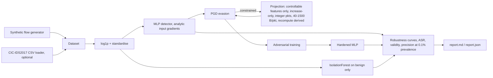

# FEINT

**A network intrusion detector built to be attacked.** FEINT trains a flow-based NIDS, red-teams it with white-box evasion under *realistic network constraints*, hardens it with adversarial training, and reports a **robustness curve** plus base-rate-honest precision instead of a single accuracy number.

Everyone reports 99% accuracy on CIC-IDS. FEINT asks what is left of that number when the attacker knows the model and pads, delays or adds packets to their own traffic to slip past it.

## Architecture



| Module | File |
| --- | --- |
| Flow schema, synthetic generator, CIC-IDS loader | `feint/data.py` |
| Detector (MLP + exact input gradient), IsolationForest member | `feint/model.py` |
| PGD (constrained / unconstrained), constraint projection, validity checker | `feint/attack.py` |
| Adversarial training | `feint/harden.py` |
| Metrics, robustness curve, base-rate precision | `feint/metrics.py` |
| End-to-end study + Markdown report | `feint/pipeline.py` |
| CLI | `feint/cli.py` |

## Quickstart

```bash
pip install -e ".[dev]"      # numpy + scikit-learn only; no torch, no downloads
make test                    # ~15 s
make demo                    # full study on 4000 synthetic flows (~2-3 min), writes results/report.md
python -m feint run --data path/to/CIC-IDS2017.csv --max-rows 100000   # optional real data
python -m feint generate --n 1000 --out flows.csv
```

## Results (synthetic data, `make demo`, seed 0)

Produced by an actual run; see `results/report.md`. eps = L-inf budget in standardised log-feature space. Detection rate is measured on 600 held-out attack flows.

**Clean test set**

| model | acc | recall | FPR | precision @ 0.1% attack prevalence |
|---|---|---|---|---|
| baseline | 0.993 | 0.981 | 0.0012 | 0.452 |
| adv-trained | 0.988 | 0.994 | 0.0155 | 0.060 |

**Constrained (realisable) PGD evasion: detection rate**

| eps | baseline | adv-trained |
|---|---|---|
| 0.0 | 0.981 | 0.994 |
| 0.5 | 0.764 | 0.983 |
| 1.0 | 0.372 | 0.983 |
| 2.0 | 0.328 | 0.964 |

**Unconstrained (textbook, unrealisable) PGD: detection rate**

| eps | baseline | adv-trained |
|---|---|---|
| 0.5 | 0.339 | 0.678 |
| 2.0 | 0.328 | 0.417 |

Takeaways:
1. **The collapse** — a 98% detector drops to 33% under white-box evasion that only pads/delays the attacker's own traffic; 100% of the constrained adversarial flows pass the validity checker.
2. **The recovery** — adversarial training restores ~96% detection at eps=2 against the constrained attacker, but only ~42% against the unconstrained one: robustness claims depend on the threat model.
3. **The cost** — hardening raised clean FPR from 0.12% to 1.55%, which at 0.1% prevalence cuts precision from 45% to 6%. Base-rate honesty matters more than the accuracy column.
4. The IsolationForest (benign-only) flagged all 242 evasions at eps=2 because they are pushed off the benign manifold. This is *not* a robustness claim: the attacker was not adaptive to it.

Numbers are from synthetic data and illustrate the methodology, not real-world performance.

## Prior art and how FEINT differs

| Existing | What it does | FEINT |
| --- | --- | --- |
| CIC-IDS / NSL-KDD classifier repos | Train, report accuracy | Reports accuracy-vs-budget curves and precision at realistic prevalence |
| IBM ART | Generic attack/defence primitives | End-to-end NIDS study with network-domain constraint projection and a validity checker; zero heavy deps |
| Kitsune | Unsupervised online NIDS | Focus is adaptive-adversary robustness reporting, not detection alone |
| SHAP / LIME / DiCE | Generic explainers | Planned: counterfactuals under the same flow constraints (TODO) |

The contribution is methodology: constrained vs unconstrained evaluation side by side, with every adversarial flow checked for realisability.

## Status and TODO (Grade C/D/E items, not built)

- [ ] XGBoost / PyTorch autoencoder ensemble members (kept to sklearn for a light install)
- [ ] Poisoning / backdoor study and training-data anomaly checks (Grade C/D)
- [ ] SHAP global importance + constraint-respecting counterfactual explanations (Grade B/C)
- [ ] Robust-feature selection and an adversarial-input detector that is evaluated against an *adaptive* attacker
- [ ] Richer constraint semantics: protocol-specific rules, problem-space validation by regenerating pcaps and re-running CICFlowMeter (Grade D)
- [ ] Full CIC-IDS2017/2018, UNSW-NB15 benchmarking (loader exists for CIC-IDS2017 column names; datasets are not bundled)
- [ ] Concept-drift analysis, model-stealing experiment
- [ ] React + Recharts dashboard (Grade E for this MVP; `report.json` is the data contract)

See [THREAT_MODEL.md](THREAT_MODEL.md) and [SECURITY.md](SECURITY.md).
