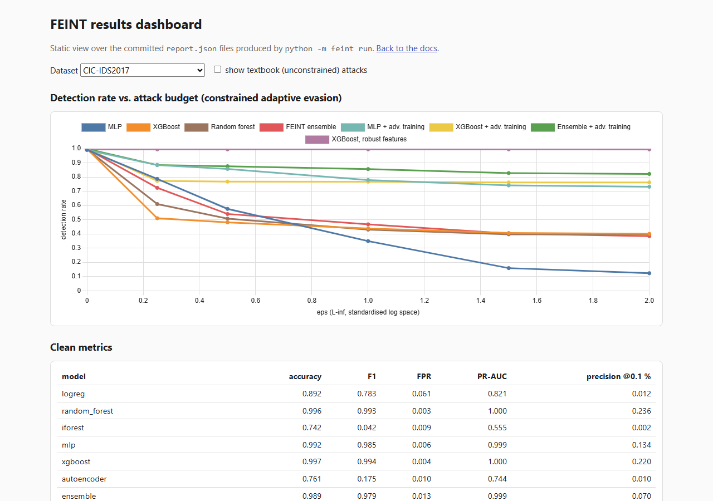
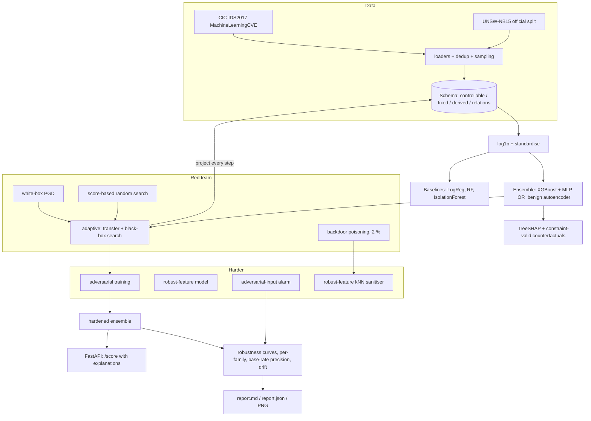

# FEINT

[](https://github.com/rakshit-737/feint/actions/workflows/ci.yml)

[](https://rakshit-737.github.io/feint/)
[](LICENSE)


**Contribution in one sentence:** FEINT derives the attacker, adversarial training, a robust-feature
model, a poison sanitiser and counterfactual explanations from *one declarative attacker-capability
schema*, and measures over 5 seeds (95 % CIs), on four datasets plus a cross-dataset transfer, what
each schema-derived defence buys against realisable adaptive evasion (evidence:
[5-seed tables](#headline-results), [ablation of constrained vs textbook attacks](#full-results),
[paper vs reproduction vs FEINT](#reproductions-paper-vs-reproduction-vs-feint)).

**A network intrusion detector built to be attacked.** FEINT trains a flow-based NIDS ensemble on
CIC-IDS2017 (original and corrected), UNSW-NB15, CSE-CIC-IDS2018 and a CICIoT2023 subsample,
red-teams it with *adaptive* evasion that respects what a network attacker can change, poisons its
training data, hardens it, explains every alert with SHAP and constraint-valid counterfactuals,
and reports **robustness curves and base-rate-honest precision** instead of one accuracy number.

> Everyone reports 99 % accuracy on CIC-IDS2017. FEINT asks what is left of that number when the
> attacker knows the model and pads, delays or adds packets to its own traffic.
> Short answer (5 seeds): **XGBoost with F1 0.994 still detects only 40 % [38, 43] of attack flows
> under a realisable attack at eps=2, and 0 % on UNSW-NB15**. Adversarial training brings XGBoost and
> the ensemble back to 79 % (CIC-IDS2017) and 94-96 % (UNSW-NB15); MLP + adversarial training reaches
> 69 % and 81 %. A model restricted to features the schema treats as attacker-immutable is untouched
> by this attacker, at +2.2 FPR points on CIC-IDS2017 and +7.1 on UNSW-NB15 (F1 0.888 -> 0.850),
> *conditional on that schema* (see Limitations). Detectors trained on CIC-IDS2017 do not transfer
> to CSE-CIC-IDS2018 (XGBoost F1 0.000 on shared families).

[](https://rakshit-737.github.io/feint/demo/)

**Docs:** https://rakshit-737.github.io/feint/ · **Dashboard:** https://rakshit-737.github.io/feint/demo/ ·
**Preprint draft:** [paper/feint.tex](paper/feint.tex)

## Try it in 60 seconds

1. Open the [results dashboard](https://rakshit-737.github.io/feint/demo/) (no install).
2. Or run a toy study in Docker: `docker run --rm ghcr.io/rakshit-737/feint:latest run --quick --n 2000 --eps 0 1 --no-figures --out /tmp/demo`
3. Or with pip: `pip install -e . && python -m feint run --quick --n 2000 --eps 0 1 --no-figures --out results/demo`
   prints a clean-metrics table and a detection-vs-eps table for each model (synthetic data, a few minutes on a laptop CPU).

## Contents

[Headline results](#headline-results) · [How it works](#how-it-works) · [Datasets](#datasets) ·
[Quickstart](#quickstart) · [Reproducing the benchmarks](#reproducing-the-benchmarks) ·
[Full results](#full-results) · [Prior art](#prior-art-and-how-feint-differs) ·
[Limitations](#limitations) · [Roadmap](#roadmap) · [Safety](#safety-and-ethics)

## Headline results

Numbers are the **mean over 5 seeds** from `results/<dataset>/seeds.json` (GitHub Actions ubuntu
runners; full 95 % Student-t CIs, n=5, t(4)=2.78, clipped to [0, 1], in
[CIC seeds.md](results/cicids2017/seeds.md) and [UNSW seeds.md](results/unsw_nb15/seeds.md); the
CIC 10 % subsample is redrawn per seed). Attack budgets `eps` are L-inf radii on the
attacker-controlled features in standardised log-feature space
([ADR 0002](docs/adr/0002-perturbation-budget-in-log-space.md)); derived features are recomputed
after projection and can move further (see Limitations). Detection rates are on 1,000 held-out
attack flows per seed; every constrained adversarial flow passed the schema validity check.
Hardened tree models and ensembles are attacked through *both* the undefended and the
adversarially-trained MLP as gradient surrogates plus 100 black-box queries, keeping the
per-flow best.

**Detection rate under constrained, adaptive evasion (higher is better), 5-seed mean; eps=2 with 95 % CI**

| model | CIC-IDS2017 eps=0 | eps=0.5 | eps=1 | eps=2 | UNSW-NB15 eps=0 | eps=0.5 | eps=1 | eps=2 |
|---|---|---|---|---|---|---|---|---|
| MLP | 0.991 | 0.531 | 0.308 | 0.058 [0.001, 0.116] | 0.964 | 0.436 | 0.181 | 0.064 [0.052, 0.077] |
| Random forest (baseline) | 0.995 | 0.456 | 0.421 | 0.377 [0.306, 0.447] | 0.971 | 0.656 | 0.152 | 0.000 [0.000, 0.000] |
| XGBoost | 0.998 | 0.450 | 0.434 | 0.405 [0.376, 0.433] | 0.967 | 0.167 | 0.145 | 0.000 [0.000, 0.000] |
| FEINT ensemble (XGB + MLP, OR autoencoder) | 0.998 | 0.557 | 0.469 | 0.369 [0.279, 0.459] | 0.969 | 0.502 | 0.445 | 0.328 [0.262, 0.394] |
| MLP + adversarial training | 0.986 | 0.814 | 0.753 | 0.688 [0.580, 0.797] | 0.961 | 0.927 | 0.888 | 0.808 [0.746, 0.869] |
| XGBoost + adversarial training | 0.999 | 0.807 | 0.805 | 0.788 [0.755, 0.821] | 0.967 | 0.960 | 0.959 | 0.941 [0.908, 0.974] |
| **FEINT ensemble + adversarial training** | 0.998 | **0.839** | **0.825** | **0.793 [0.763, 0.823]** | 0.969 | **0.965** | **0.964** | **0.962 [0.957, 0.968]** |
| XGBoost, robust features only | 0.994 | 0.994 | 0.994 | 0.994 [0.993, 0.995] | 0.942 | 0.942 | 0.942 | 0.942 [0.935, 0.950] |


What the numbers say:

1. **The collapse is real, and textbook attacks overstate it.** Textbook (unconstrained,
   all-feature) attacks drive the undefended MLP, XGBoost and ensemble (the three models attacked
   that way) to 0.000-0.044 detection on CIC-IDS2017 at eps=0.5 (seed 0), but produce 0 % realisable
   flows. Under the realistic constraints the undefended XGBoost keeps 42 %,
   almost entirely volume attacks (DoS Hulk 94 %, GoldenEye 64 %, DDoS 57 %) whose server-side
   features the attacker cannot touch; PortScan, slowloris, Slowhttptest, FTP/SSH-Patator, Bot and
   web attacks all go to 0 %. The two attacks are not budget-matched, so neither is an upper bound
   of the other: the constrained attack moves only controllable features by at most eps but the
   recomputed derived features can move further, while the textbook attack moves every feature by
   at most eps (on UNSW-NB15 the ensemble keeps 0.353 at eps=2 against the textbook attack;
   see Limitations).
2. **The most important feature is attacker-controlled.** TreeSHAP ranks `init_win_fwd` (client TCP
   window) first on CIC-IDS2017 and `sttl` (source IP TTL, a known UNSW-NB15 testbed artefact) first
   on UNSW-NB15. Controlling *only* `sttl` drops UNSW XGBoost detection to 0.2 %; controlling only
   `init_win_fwd` drops CIC detection to 48 %.
3. **Hardening works at little clean cost.** Adversarial training keeps clean F1 within 0.002
   (5-seed means) and restores constrained detection at eps=2 to 0.79 (CIC) and 0.94-0.96 (UNSW) for
   XGBoost and the ensemble, 0.69 / 0.81 for the MLP. Restricting the model to the features the
   schema fixes makes it immune to *this* attacker by construction, for a clean FPR of 2.6 % instead
   of 0.4 % on CIC and 33 % instead of 26 % on UNSW; that immunity holds only if those features
   really are out of the attacker's reach (they are not entirely, see Limitations). On CIC-IDS2017
   the ensemble and XGBoost cannot be told apart at eps=2 (0.369 vs 0.405, CIs overlap), and the
   ensemble pays about 4x the FPR.
4. **Base rates matter more than the leaderboard.** XGBoost's 99.7 % accuracy and 0.35 % FPR mean
   only **22 % of its alerts are real at a 0.1 % attack prevalence**; on UNSW-NB15 (26 % FPR on the
   official test split) that falls to 0.4 %.

| study | CIC-IDS2017 | UNSW-NB15 |
|---|---|---|
| Counterfactuals (seed 0, single attack at eps_max=2, 50 queries): XGBoost alerts with a realisable evasion | 60.0 % of 200 (2.07 features changed, median eps 0.031) | 99.5 % of 200 (2.09 features) |
| ...same, against the adversarially-trained ensemble (a different model; lower bound, weaker attack than the curves) | 7.5 % | 0.5 % |
| Adversarial-input alarm, static attacker (ROC-AUC / FPR on clean) | 1.000 / 1.2 % | 1.000 / 1.7 % |
| ...detector-aware attacker vs. XGBoost OR alarm, single attack at eps=2 (not a union over budgets) | detection 0.876, benign FPR 2.8 % | detection 1.000, benign FPR 28.3 % |
| Backdoor, 2 % of a 100k-flow training subsample poisoned: success clean -> poisoned -> sanitised (5 seeds) | 0.33 [0.32, 0.34] -> **1.00** -> 0.08 [0.02, 0.14] | 0.04 [0.02, 0.05] -> **1.00** -> 0.68 [0.62, 0.74] |
| Sanitiser poison recall / precision (5 seeds) | 0.99 / 0.51 | 0.95 / 0.36 |
| Sanitiser cost: clean benign flows removed / clean accuracy | 2.6 % / 0.996 -> 0.985 | 10.8 % / 0.866 -> 0.840 |

**Drift (CIC-IDS2017, train Monday-Wednesday, test Thursday-Friday).** Supervised models do not
generalise to unseen attack families: XGBoost recall is 0.5 % on PortScan (n=9,074), 0 % on Bot, 0 % on
Infiltration. The benign-trained autoencoder catches 29 of 36 Infiltration flows (81 %, Wilson 95 %
CI 65-90 %), which is why the ensemble ORs it in (at 3.2 % FPR instead of 0.04 %).

## How it works



| stage | what FEINT does | code |
|---|---|---|
| Constraints | Per-dataset schema: `up` (only increase: duration, packets, payload), `free` (TCP window, TTL), integer, fixed (server side, dst port, context), derived (recomputed); relations `bytes <= pkts*MTU`, `mean <= max_len <= min(bytes, MTU)`. `project()` + `is_valid()`. | [`schema.py`](feint/schema.py), [ADR 0001](docs/adr/0001-feature-space-constraint-schemas.md) |
| Detect | XGBoost, MLP (analytic input gradients), benign-trained autoencoder, ensemble = `max(mean(XGB, MLP), AE)`; LogReg / RF / IsolationForest baselines | [`model.py`](feint/model.py) |
| Evade | White-box PGD; multi-scale score-based random search; *adaptive* = PGD on target or surrogate, refined black-box, best per flow; curves are monotone (best over all budgets up to eps) | [`attack.py`](feint/attack.py), [ADR 0003](docs/adr/0003-own-attack-engine-instead-of-art.md) |
| Poison | Copies of attack flows with a trigger in an attacker-controllable feature, labelled benign; sanitiser flags benign-labelled points whose neighbours in *robust-feature space* are malicious | [`poison.py`](feint/poison.py) |
| Harden | Adversarial training (any model, any attack), robust-feature model, adversarial-input alarm evaluated against a detector-aware attacker | [`harden.py`](feint/harden.py) |
| Explain | Exact TreeSHAP via XGBoost; counterfactual = minimal-budget constrained evasion (bisection) + greedy sparsification, reported in raw units | [`explain.py`](feint/explain.py), [ADR 0005](docs/adr/0005-native-treeshap-and-constrained-counterfactuals.md) |
| Report | Clean metrics, PR-AUC, precision at 1 % / 0.1 % prevalence, curves, per-family, feature exploitability, drift | [`metrics.py`](feint/metrics.py), [`pipeline.py`](feint/pipeline.py), [`report.py`](feint/report.py) |
| Serve | `feint serve`: `/score` returns verdict, top SHAP features and a counterfactual per flow | [`api.py`](feint/api.py) |

Example counterfactuals produced for real CIC-IDS2017 alerts:

```
flip to benign by: init_win_fwd 1024 -> 901
flip to benign by: fwd_pkts 9 -> 10; init_win_fwd 29200 -> 30150
no realisable evasion within budget: this alert is robust to the modelled attacker
```

## Datasets

| dataset | what we use | size | licence / terms | citation |
|---|---|---|---|---|
| **CIC-IDS2017** | `MachineLearningCSV.zip` (CICFlowMeter features, 8 day files, 2,830,743 flows, 14 attack classes). 11 columns mapped into the schema; 530,897 exact duplicates dropped; 10 % per-class sample with a floor of 5,000 (rare classes kept whole) = 253,259 flows, 25.7 % attacks; stratified 70/30 split. | 235 MB zip, 885 MB CSV | Free for research with citation, per the Canadian Institute for Cybersecurity (UNB) | Sharafaldin, Lashkari, Ghorbani. *Toward Generating a New Intrusion Detection Dataset and Intrusion Traffic Characterization.* ICISSP 2018 |
| **UNSW-NB15** | Official partition: training set 175,341 flows, testing set 82,332 flows (10 classes). 22 features (14 direct, 2 protocol flags, 6 derived). | 48 MB | Free for academic research with citation, per UNSW Canberra Cyber | Moustafa, Slay. *UNSW-NB15: a comprehensive data set for network intrusion detection systems.* MilCIS 2015 |

Official hosts gate downloads behind forms, so `scripts/download_*.py` fetch third-party
mirrors from the Hugging Face Hub (not checked byte-for-byte against the official archives; row
counts match the official releases: 2,830,743 CIC flows, 175,341 / 82,332 UNSW flows), resume
interrupted transfers and **verify SHA-256** against the pinned hashes ([ADR 0006](docs/adr/0006-data-sources-sampling-and-splits.md)). Datasets are
never committed; `tests/fixtures/` holds ~930 sampled rows for CI.

## Quickstart

```bash
git clone https://github.com/rakshit-737/feint && cd feint
pip install -e ".[dev]"                 # numpy, pandas, scikit-learn, xgboost (+ matplotlib, fastapi for dev)
python -m pytest -q                     # real-data tests skip without datasets
python -m feint run --quick --n 3000 --out results/demo   # synthetic smoke study (~5 min laptop CPU)
```

Score flows over HTTP with explanations, using a toy model built from the committed fixtures:

```bash
pip install -e ".[api]"
python -m feint run --data unsw_nb15 --data-dir tests/fixtures --quick --no-figures --save-model --out results/unsw_demo
python -m feint serve --model results/unsw_demo/model.joblib
curl -s localhost:8000/score -H 'content-type: application/json' \
  -d '{"explain": true, "flows": [{"dur": 0.00001, "spkts": 2, "dpkts": 0, "sbytes": 114, "sttl": 254, "proto_udp": 1}]}'
```

## Reproducing the benchmarks

`make` is optional; every target is a plain command.

| step | command | time (laptop CPU, shared with other jobs) |
|---|---|---|
| download data | `python scripts/download_unsw_nb15.py && python scripts/download_cicids2017.py` (set `FEINT_DATA` to choose the directory, default `./data`) | network bound |
| UNSW-NB15 study | `python -m feint run --data unsw_nb15 --out results/unsw_nb15 --save-model` | ~65 min (3,776 s recorded) |
| CIC-IDS2017 study | `python -m feint run --data cicids2017 --out results/cicids2017` | ~60 min (+7 min first CSV load; cached after) |
| 5-seed, cross-dataset, reproduction, stealing studies | `gh workflow run bench.yml -f study=seeds-unsw` (also `seeds-cic`, `seeds-cic-corrected`, `seeds-iot`, `xdata`, `repro-sharafaldin`, `repro-moustafa`, `steal-cic`) | GitHub Actions, one job per seed |
| real-data tests | `FEINT_DATA=./data python -m pytest -q -m realdata` | |

Key knobs: `--eps`, `--iters` (black-box queries), `--steps` (PGD), `--adv-rounds`, `--max-eval`,
`--frac` (CIC sampling), `--seed`.

## Full results

Complete generated reports, including per-family tables, SHAP rankings, single-feature
exploitability, counterfactual statistics, poisoning and drift tables:
[CIC-IDS2017](results/cicids2017/report.md) · [UNSW-NB15](results/unsw_nb15/report.md).

**Clean detection vs. baselines and published numbers (seed 0, `report.json`)**

| model | CIC acc | CIC F1 | CIC FPR | CIC prec @0.1 % | UNSW acc | UNSW F1 | UNSW FPR |
|---|---|---|---|---|---|---|---|
| Logistic regression | 0.8925 | 0.7833 | 0.0607 | 0.012 | 0.8128 | 0.8512 | 0.3832 |
| Random forest | 0.9963 | 0.9928 | 0.0032 | 0.236 | 0.8643 | 0.8874 | 0.2661 |
| IsolationForest (unsupervised) | 0.7420 | 0.0420 | 0.0093 | 0.002 | 0.4459 | 0.0108 | 0.0146 |
| Autoencoder (unsupervised) | 0.7611 | 0.1751 | 0.0100 | 0.010 | 0.5857 | 0.4167 | 0.0259 |
| MLP | 0.9925 | 0.9854 | 0.0064 | 0.134 | 0.8566 | 0.8817 | 0.2822 |
| XGBoost | **0.9970** | **0.9942** | 0.0035 | 0.220 | **0.8654** | **0.8879** | 0.2605 |
| FEINT ensemble | 0.9892 | 0.9794 | 0.0134 | 0.070 | 0.8566 | 0.8820 | 0.2856 |
| FEINT ensemble + adv. training | 0.9889 | 0.9789 | 0.0137 | 0.068 | 0.8605 | 0.8844 | 0.2720 |
| XGBoost, robust features only | 0.9794 | 0.9612 | 0.0255 | 0.037 | 0.8159 | 0.8485 | 0.3324 |
| *Published: RF, Sharafaldin et al. 2018, Table 4 (per-attack selected features of Table 3, weighted multi-class P/R/F1; split not reported)* | | *0.97* | | | | | |
| *Published: decision tree, Moustafa & Slay 2016 [^ms16] (FAR 15.78 %)* | | | | | *0.8556* | | |

On CIC-IDS2017 with 11 of the ~80 CICFlowMeter features and de-duplicated data, XGBoost reaches
binary F1 0.994; on the UNSW-NB15 official split XGBoost reaches 86.6 % accuracy vs. the published
85.6 % decision tree (see the reproduction table for a like-for-like run). Published numbers use different feature
sets and preprocessing and are shown for orientation, not as a controlled comparison.
The Sharafaldin et al. figure (RF: Pr 0.98, Rc 0.97, F1 0.97) was checked against Table 4 of the
ICISSP 2018 paper; the Moustafa & Slay figure (DT: 85.56 % accuracy, 15.78 % FAR) was checked
against secondary sources only, as the paper itself is paywalled.

[^ms16]: N. Moustafa, J. Slay. *The evaluation of Network Anomaly Detection Systems: Statistical
    analysis of the UNSW-NB15 data set and the comparison with the KDD99 data set.* Information
    Security Journal: A Global Perspective 25(1-3), 2016.


| CIC-IDS2017 global importance | CIC-IDS2017 drift |
|---|---|
|  |  |

## New datasets, corrected labels and cross-dataset transfer

All runs below are GitHub Actions jobs (`.github/workflows/bench.yml`), never the shared laptop.

**Corrected CIC-IDS2017** (Engelen et al. 2021; the CNS 2022 re-release by Liu et al., which also
fixes CSE-CIC-IDS2018). With labelling and flow-construction errors fixed and "attempted" flows
relabelled benign, clean scores rise (XGBoost F1 0.9999, FPR 0.05 %) and so does robustness:
over 5 seeds undefended XGBoost keeps 0.523 [0.490, 0.556] detection at eps=2 (0.405 on the
original), random forest falls to 0.005, adversarially trained models stay at 0.980-0.997, and the
poison sanitiser's precision rises from 0.51 to 0.94 ([seeds.md](results/cicids2017_corrected/seeds.md),
[report](results/cicids2017_corrected/report.md)). Part of the original
dataset's apparent difficulty comes from mislabelled flows.

**CSE-CIC-IDS2018 and cross-dataset transfer.** Three day files (1.09 GB; Bot, FTP/SSH brute
force, DoS GoldenEye/Slowloris), SHA-256 pinned from a size-verified CI download. Training on
corrected CIC-IDS2017 and testing on 2018 over the harmonised 11-feature schema and shared
families, 5 seeds ([results](results/xdata/)): XGBoost F1 **0.000** [0.000, 0.000], adversarially
trained XGBoost 0.211, robust-feature XGBoost 0.506 (SSH brute force recall 0.994, the rest near 0).
The reverse direction gives 0.015 / 0.488 [0.078, 0.898] / 0.024. Hardening changes what
transfers, but nothing transfers well: the detectors learn dataset artefacts, not attack behaviour.

**CICIoT2023 (subsample, negative result).** A public ipfixprobe Parquet re-export, one capture
per class, at most 5,000 flows per label (16 GB RAM); not comparable with the official CSV
features of Neto et al. 2023. With these features benign and attack captures are not separable:
every model reaches F1 0.98 only by flagging almost everything (benign FPR 0.82-0.997, 5 seeds,
[seeds.md](results/ciciot2023/seeds.md)). We report it as a failed transfer of the pipeline to
IoT data, not as a detector.

### Reproductions: paper vs reproduction vs FEINT

| paper (setup) | metric | paper | our reproduction under the paper's setup | FEINT (own setup) |
|---|---|---|---|---|
| Moustafa & Slay 2016, decision tree, official UNSW-NB15 split, all 42 features ([json](results/repro/moustafa2016.json)) | accuracy / FAR | 0.8556 / 0.1578 (secondary source) | 0.8649 / 0.2484 | XGBoost, 22 features: 0.8655 / FPR 0.259 |
| Sharafaldin et al. 2018 Table 4, RF on the union of the Table 3 per-attack selected features, weighted multi-class P/R/F1, split not reported | F1 | 0.97 | RF 0.999 (KNN 0.995, ID3 0.998, AdaBoost 0.888, MLP 0.981, NB 0.141; QDA could not be fitted) ([json](results/repro/sharafaldin2018.json)) | binary F1 0.994 on 11 de-duplicated schema features; not like-for-like |
| Vitorino et al. 2022 (A2PM, adversarial NIDS) | | | not attempted this round (needs a numpy<2, Python 3.11 job) | |

Accuracy reproduces within one point; our false-alarm rate is far above the quoted 15.78 %, which
we could check only against secondary sources (the paper is paywalled).

Our Sharafaldin reproduction (stratified 70/30 split, duplicates kept, scikit-learn defaults; split and hyperparameters are our assumptions) has a higher F1 than Table 4 for every classifier that fits: RF 0.999 vs 0.97, and AdaBoost/MLP about 0.89/0.98 vs 0.77/0.76. A random split with duplicates kept leaks near-identical flows into the test set, which is the most likely reason; QDA fails because the benign covariance matrix is singular on these features, so we report it as not reproduced.

### Model stealing (label-only queries -> transfer attack), seed 0

| surrogate | CIC-IDS2017 agreement | victim det. eps=0.5 / 1 / 2 | UNSW-NB15 agreement | victim det. eps=0.5 / 1 / 2 |
|---|---|---|---|---|
| true labels, full training set | 0.995 | 0.631 / 0.612 / 0.567 | 0.937 | 0.544 / 0.400 / 0.245 |
| stolen, 500 label queries | 0.837 | 0.529 / 0.520 / 0.445 | 0.785 | 0.568 / 0.329 / 0.178 |
| stolen, 2000 label queries | 0.956 | 0.525 / 0.504 / 0.452 | 0.914 | 0.435 / 0.360 / 0.001 |
| stolen, 10000 label queries | 0.989 | 0.547 / 0.518 / 0.478 | 0.918 | 0.514 / 0.422 / 0.001 |

With 2,000 hard-label queries a stolen MLP transfers at least as well as one trained on the true
labels at eps=2 on both datasets; at smaller budgets it depends on the budget. That the stolen copy
imitates the victim's boundary is an untested hypothesis. Single seed.

## Prior art and how FEINT differs

| work | what it does | FEINT's difference |
|---|---|---|
| Thousands of CIC-IDS / NSL-KDD classifier repos | Train, report accuracy | Robustness curves, adaptive attacks, base-rate precision, drift, poisoning |
| IBM Adversarial Robustness Toolbox | Attack / defence primitives | End-to-end NIDS study; attacks are *schema-constrained* inside the loop and adaptive against the full ensemble ([ADR 0003](docs/adr/0003-own-attack-engine-instead-of-art.md)) |
| Kitsune (Mirsky et al., NDSS 2018) | Online autoencoder NIDS | Uses an autoencoder member, but the study is about adaptive-adversary robustness |
| Constrained / feasible evasion research (e.g. Sheatsley et al. 2022; Chernikova & Oprea, FENCE 2022; Apruzzese et al. 2022; Pierazzi et al., S&P 2020 on problem-space attacks) | Show that realistic constraints change robustness conclusions | FEINT is a reproducible, tested, two-dataset implementation of that methodology with hardening, counterfactual explanations and poisoning in one pipeline, not a new algorithm |
| SHAP / LIME / DiCE | Generic explainers | Counterfactuals obey the same network constraints as the red team, so "what would evade this alert" is a realisable answer |

Closest prior work on the individual ideas: Tong et al. (USENIX Security 2019) "conserved
features", the same idea as FEINT's robust-feature model; Paudice et al. (2018) kNN label
sanitisation, FEINT's sanitiser without the robust-feature restriction; Vitorino et al. (A2PM,
Future Internet 2022) and Simonetto et al. (IJCAI 2022) on constrained adversarial examples for
tabular and network data; Engelen et al. (2021) and Liu et al. (CNS 2022) on CIC dataset errors.

**Honest gap:** the attack primitives, datasets and explainers all exist. FEINT's contribution is the
single schema driving every component, and the disciplined end-to-end study and its honesty rules: realisable perturbations only, adaptive attacks
against the *defended* system, monotone curves, fixed-prevalence precision, and published limitations.

## Limitations

- **Feature-space, not problem-space.** Constraints approximate what packet-level changes can do;
  side effects (more packets also lengthen duration) and attack semantics (a DoS needs its volume)
  are not enforced, which favours the attacker. But the schema also treats as *fixed* several
  features a client can influence indirectly: `ct_*` (its own connection counts, via pacing or
  decoy connections), `trans_depth` (HTTP pipelining), and server-response features `bwd_*` /
  `dbytes` and `syn_count` (via request choice and retransmissions). That favours the defender, and
  the robust-feature model's flat curve is conditional on it.
- **Budget semantics.** eps bounds the controllable features; derived features (rates, means) are
  recomputed after projection and integer rounding, so the realised all-feature L-inf can exceed eps.
  The textbook attack bounds all features by eps. The two are not budget-matched and neither is a
  superset of the other.
- **Empirical robustness only.** Our attacks are strong but not exhaustive; every robustness number
  is an upper bound. Adversarial training was evaluated with the same attack family it trained on.
- **The adversarial-input alarm's 1.000 AUC is not a robustness claim.** Against a detector-aware
  attacker (one attack at eps=2, gradients from an alarm-unaware MLP) it detects 0.876 on
  CIC-IDS2017 but raises FPR to 2.8 %; this single-budget figure may be optimistic.
- **Poisoning defence is partial.** The robust-feature kNN sanitiser recovers most poisons but a
  handful of survivors keeps the backdoor alive (5 seeds: success 0.08 on CIC, 0.68 on UNSW), and on
  UNSW it removes 10.8 % of clean benign flows, costing 2.6 points of clean accuracy. On CIC the
  trigger value alone already evades 33 % of the clean model's detections because `init_win_fwd` is
  itself a strong, attacker-controlled feature.
- **Dataset artefacts.** CIC-IDS2017 has known labelling issues (Engelen et al., 2021) and UNSW-NB15's
  `sttl` / `swin` separate classes because of the testbed; both inflate clean scores. FEINT surfaces
  them (SHAP, single-feature attacks) rather than fixing them.
- **Sampling.** CIC results use a de-duplicated 10 % per-class sample (floor 5,000 flows, smaller
  classes kept whole; duplicates counted in the 11-feature schema projection) for CPU budget; UNSW
  uses the full official split; CICIoT2023 is capped at 5,000 flows per label. The 5-seed study
  covers clean metrics, constrained curves (undefended, adversarially trained and robust-feature
  models) and poisoning; counterfactuals, the alarm and stealing are single-seed.
- **UNSW derived features** (`sload`, `dload`, `sinpkt`, `smean`, `dmean`) are recomputed from base
  columns with a different convention from the published columns (e.g. the `sload` ratio is about
  spkts/(spkts-1)); only `rate` matches. Clean metrics can differ slightly from models trained on the
  published columns.
- **Not implemented from the spec:** self-captured lab pcaps via CICFlowMeter (needs an isolated lab
  network and traffic generation; not feasible on this machine). The React dashboard is replaced by a
  static JavaScript dashboard over the committed JSON reports ([demo](https://rakshit-737.github.io/feint/demo/)).

## Roadmap

- [x] Multiple seeds with confidence intervals (`feint seeds`)
- [x] Model-stealing experiment (`feint steal`)
- [x] Docs site, static dashboard, Docker image and tagged releases
- [ ] Problem-space validation: replay perturbed flows in a lab network and re-extract with CICFlowMeter
- [ ] Coupled constraints (packets -> duration, connection rate -> `ct_*`) and attack-semantics constraints
- [ ] Certified / randomised-smoothing baseline for tabular features
- [ ] Stronger poisoning defences (spectral signatures, trigger-value audits) and clean-label poisoning
- [x] CSE-CIC-IDS2018, corrected CIC-IDS2017 and CICIoT2023 loaders; cross-dataset study (`feint xdata`)
- [x] Adversarial training and poisoning in the 5-seed study
- [ ] Budget-matched textbook attack and realised all-feature L-inf per curve point
- [ ] A2PM reproduction
- [ ] Schema-relaxation ablation (attacker may move `ct_*`, `trans_depth`, bounded `bwd_*`)

## Repository layout

```
feint/        schema, data, model, attack, harden, explain, poison, metrics, pipeline, report, api, cli
scripts/      download_cicids2017.py, download_unsw_nb15.py (checksummed, resumable)
results/      cicids2017/, unsw_nb15/ : report.md, report.json, figures
tests/        pytest suite + tiny real-data fixtures
docs/adr/     architecture decision records
```

## Safety and ethics

FEINT is a defensive, lab-only research tool. It attacks **feature vectors** of public datasets
against models trained locally; it generates no traffic, contains no exploit code or malware and
scans nothing. The evasion techniques studied (padding, delays, TCP window / TTL choice) are
well known; publishing their measured effect helps defenders choose robust features. See
[THREAT_MODEL.md](THREAT_MODEL.md) and [SECURITY.md](SECURITY.md).

## License and citation

Code: [MIT](LICENSE). Datasets keep their original terms; cite the dataset papers above when using
the results. Contributions welcome, see [CONTRIBUTING.md](CONTRIBUTING.md) and the
[changelog](CHANGELOG.md).
