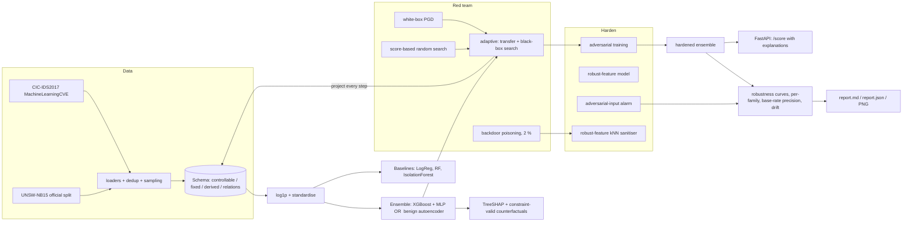
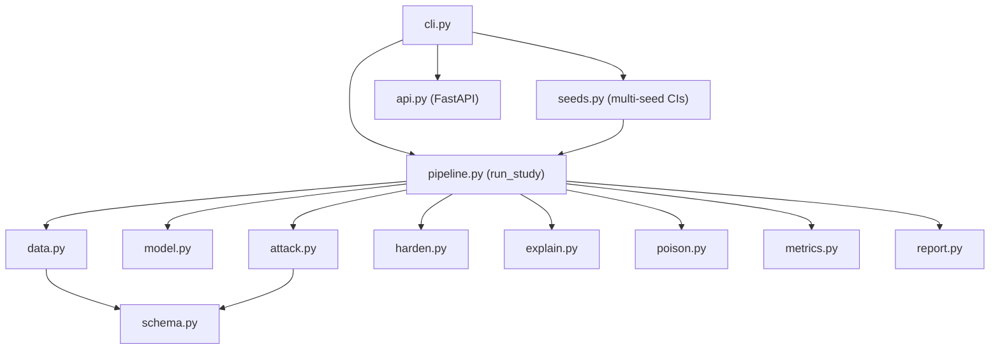

# Architecture



| stage | what FEINT does | code |
|---|---|---|
| Constraints | Per-dataset schema: `up` (only increase: duration, packets, payload), `free` (TCP window, TTL), integer, fixed (server side, dst port, context), derived (recomputed); relations `bytes <= pkts*MTU`, `mean <= max_len <= min(bytes, MTU)`. `project()` + `is_valid()`. | [`schema.py`](https://github.com/rakshit-737/feint/blob/main/feint/schema.py), [ADR 0001](adr/0001-feature-space-constraint-schemas.md) |
| Detect | XGBoost, MLP (analytic input gradients), benign-trained autoencoder, ensemble = `max(mean(XGB, MLP), AE)`; LogReg / RF / IsolationForest baselines | [`model.py`](https://github.com/rakshit-737/feint/blob/main/feint/model.py) |
| Evade | White-box PGD; multi-scale score-based random search; *adaptive* = PGD on target or surrogate, refined black-box, best per flow; curves are monotone (best over all budgets up to eps) | [`attack.py`](https://github.com/rakshit-737/feint/blob/main/feint/attack.py), [ADR 0003](adr/0003-own-attack-engine-instead-of-art.md) |
| Poison | Copies of attack flows with a trigger in an attacker-controllable feature, labelled benign; sanitiser flags benign-labelled points whose neighbours in *robust-feature space* are malicious | [`poison.py`](https://github.com/rakshit-737/feint/blob/main/feint/poison.py) |
| Harden | Adversarial training (any model, any attack), robust-feature model, adversarial-input alarm evaluated against a detector-aware attacker | [`harden.py`](https://github.com/rakshit-737/feint/blob/main/feint/harden.py) |
| Explain | Exact TreeSHAP via XGBoost; counterfactual = minimal-budget constrained evasion (bisection) + greedy sparsification, reported in raw units | [`explain.py`](https://github.com/rakshit-737/feint/blob/main/feint/explain.py), [ADR 0005](adr/0005-native-treeshap-and-constrained-counterfactuals.md) |
| Report | Clean metrics, PR-AUC, precision at 1 % / 0.1 % prevalence, curves, per-family, feature exploitability, drift | [`metrics.py`](https://github.com/rakshit-737/feint/blob/main/feint/metrics.py), [`pipeline.py`](https://github.com/rakshit-737/feint/blob/main/feint/pipeline.py), [`report.py`](https://github.com/rakshit-737/feint/blob/main/feint/report.py) |
| Serve | `feint serve`: `/score` returns verdict, top SHAP features and a counterfactual per flow | [`api.py`](https://github.com/rakshit-737/feint/blob/main/feint/api.py) |

Example counterfactuals produced for real CIC-IDS2017 alerts:

```
flip to benign by: init_win_fwd 1024 -> 901
flip to benign by: fwd_pkts 9 -> 10; init_win_fwd 29200 -> 30150
no realisable evasion within budget: this alert is robust to the modelled attacker
```

## Module map


